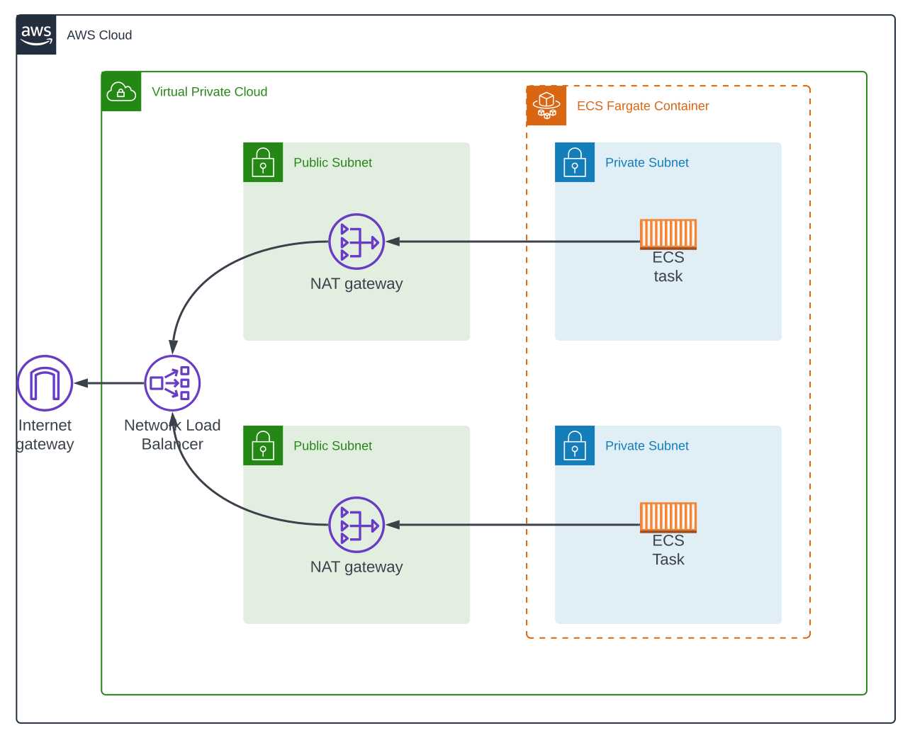

# copperleaf-app

WebApp internet facing on AWS ECS Fargate.


## Overview

The solution uses Nginx deployed in a ECS Fargate and it is accesible through internet.
The set tools and platforms that have been used are:
    - Terraform
    - AWS
    - Github Actions


## Table of Contents

1. [Solution diagram](#solution_diagram)
2. [Usage](#usage)
3. [Resources](#resources)
4. [Versions](#versions)
5. [Author](#author)


## Solution diagram




## Usage

### Prerequisites

1. Git SCM
    - Install on Windows: https://www.git-scm.com/download/win
    - Install on Linux: https://www.git-scm.com/download/linux
    - Install on MacO: Shttps://www.git-scm.com/download/mac

2. Terraform: https://developer.hashicorp.com/terraform/install 

3. AWS Account: https://aws.amazon.com/

4. AWS Access and Secret Key: https://docs.aws.amazon.com/IAM/latest/UserGuide/id_credentials_access-keys.html#Using_CreateAccessKey


### Steps

1. Clone the repository
```bash
git clone https://github.com/timossileandro/terraform-aws-asg-rds.git
```

2. Change directory
```bash
cd copperleaf-app
```

3. Customise
    - variables.tf: change default values as needed.
    - Change env variables into ecr_docker_build_push.yaml specifying AWS account and region as needed.
    - Check and modify configuration parameters in each resource as needed. 

4. Create a new Git Repo
    - Configure a dev branch.
    - Configure 'production' and 'sandbox' environments.
    - Add AWS ACCESS and SECRET keys as Action Secrets.

5. Push the cloned file from the previus repo into the new one.

6. Go to the Github repo, Actions tab and run workflows as need (dev or main branches, and sandbox or production environment).


## Resources

| Name | Type |
|----------|----------|
[aws_cloudwatch_log_group](https://registry.terraform.io/providers/hashicorp/aws/latest/docs/resources/cloudwatch_log_group) | resource | 
[aws_cloudwatch_metric_alarm](https://registry.terraform.io/providers/hashicorp/aws/latest/docs/resources/cloudwatch_metric_alarm) | resource |
[aws_sns_topic](https://registry.terraform.io/providers/hashicorp/aws/latest/docs/resources/sns_topic) | resource |
[aws_sns_topic_subscription](https://registry.terraform.io/providers/hashicorp/aws/latest/docs/resources/sns_topic_subscription) | resource |
[aws_route53_zone](https://registry.terraform.io/providers/hashicorp/aws/latest/docs/resources/route53_zone) | resource |
[aws_route53_record](https://registry.terraform.io/providers/hashicorp/aws/latest/docs/resources/route53_record) | resource |
[aws_ecr_repository](https://registry.terraform.io/providers/hashicorp/aws/latest/docs/resources/ecr_repository) | resource |
[aws_ecs_cluster](https://registry.terraform.io/providers/hashicorp/aws/latest/docs/resources/ecs_cluster) | resource |
[aws_ecs_service](https://registry.terraform.io/providers/hashicorp/aws/3.14.1/docs/resources/ecs_service) | resource |
[aws_ecs_task_definition](https://registry.terraform.io/providers/hashicorp/aws/latest/docs/resources/ecs_task_definition) | resource |
[aws_iam_role](https://registry.terraform.io/providers/hashicorp/aws/latest/docs/resources/iam_role) | resource |
[aws_iam_role_policy_attachment](https://registry.terraform.io/providers/hashicorp/aws/latest/docs/resources/iam_role_policy_attachment) | resource |
[aws_internet_gateway](https://registry.terraform.io/providers/hashicorp/aws/latest/docs/resources/internet_gateway) | resource |
[aws_route](https://registry.terraform.io/providers/hashicorp/aws/latest/docs/resources/route) | resource |
[aws_route_table](https://registry.terraform.io/providers/hashicorp/aws/latest/docs/resources/route_table) | resource |
[aws_route_table_association](https://registry.terraform.io/providers/hashicorp/aws/latest/docs/resources/route_table_association) | resource |
[aws_lb](https://registry.terraform.io/providers/hashicorp/aws/latest/docs/resources/lb) | resource |
[aws_lb_target_group](https://registry.terraform.io/providers/hashicorp/aws/latest/docs/resources/lb_target_group) | resource |
[aws_lb_listener](https://registry.terraform.io/providers/hashicorp/aws/latest/docs/resources/lb_listener) | resource |
[aws_security_group](https://registry.terraform.io/providers/hashicorp/aws/latest/docs/resources/security_group) | resource |
[aws_vpc](https://registry.terraform.io/providers/hashicorp/aws/latest/docs/resources/vpc) | resource |
[aws_subnet](https://registry.terraform.io/providers/hashicorp/aws/latest/docs/resources/subnet) | resource |


## Versions

Deployment has been tested under versions:
    - Terraform 1.8.4


## Author

- **Leandro Timossi** - [leandrotimossi](https://github.com/timossileandro)

